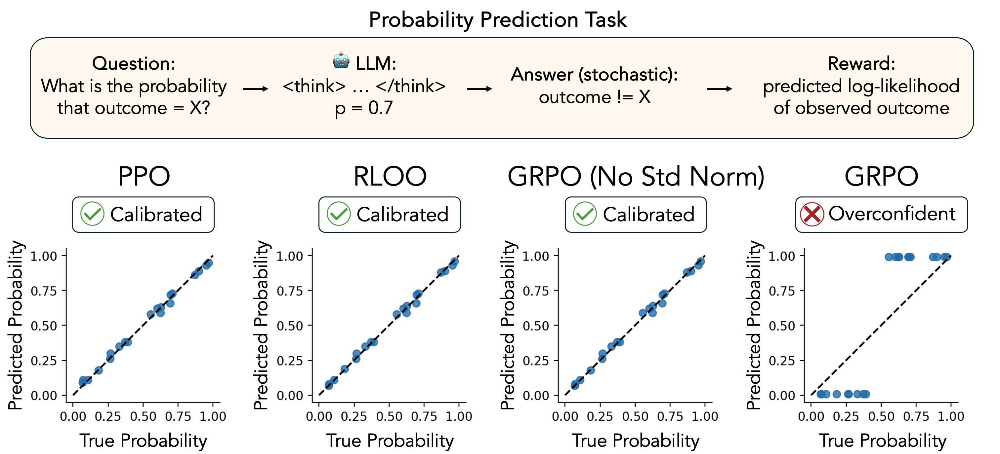
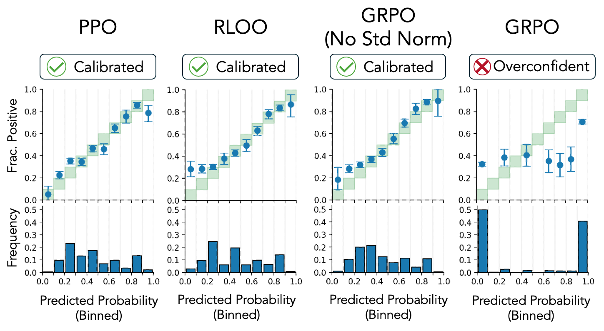

# Code for "Uncalibrated Reasoning: GRPO Induces Overconfidence for Stochastic Outcomes"



[**Paper**](https://arxiv.org/abs/2508.11800)

## Environment

1. Install uv (https://docs.astral.sh/uv/getting-started/installation/)
2. Clone verl and match commit used in paper experiments for reproducibility
```
git clone https://github.com/volcengine/verl.git
cd verl
git checkout dc805c78976967d5c3043d1a9346792fe581bf45
cd ..
```
3. Install environment
```
uv sync --no-install-package flash-attn  # flash-attn needs to be installed after torch
uv sync --no-build-isolation
```
4. Download Qwen3-4B (if running perturbation experiments)
```
mkdir -p data_cache/models/
git lfs install # make sure git-lfs is installed
git clone https://huggingface.co/Qwen/Qwen3-4B data_cache/models/Qwen3-4B
```

## Synthetic Data Experiments
`synthetic/prediction.ipynb`: train models with synthetic data + plot results (as shown in paper figure 1)

`synthetic/explanation.ipynb`: estimate expected advantages + plot under different policies (as shown in paper figure 3)


## Perturbation Experiments

<!-- 
Figure 2: Results from biological experiment prediction task (CRISPRi perturb-seq data) -->


### View paper results only

`perturbation/view_results.ipynb`: load predictions and plot results. Uses paper predictions with `load_paper_data=True` (as shown in paper figure 2)

### Train models + generate your own predictions

`perturbation/train.sh`: train Qwen3-4B on biological experiment data (perturb-seq). May consider changing checkpoint frequency or removing unneeded checkpoints afterwards to save space.

`perturbation/run_merge.sh`: convert FSDP checkpoints to huggingface model checkpoint for each experiment

`perturbation/eval.sh`: generate predictions from checkpoints

`perturbation/view_results.ipynb`: load predictions and plot results. Uses your own predictions with `load_paper_data=False`
